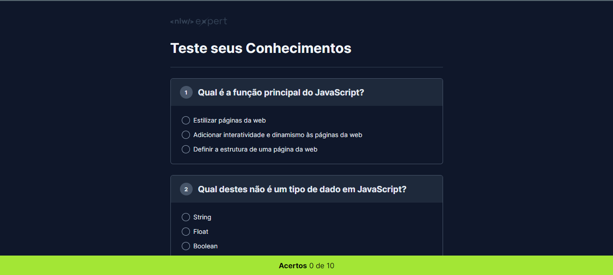

# NLW Expert - Quiz JS

## Sobre o Projeto 🚀

Projeto realizado durante o evento NLW Expert da Rocketseat onde a trilha escolhida foi HTML+CSS+JS.

O projeto da trilha foi um quiz sobre Fundamentos de JavaScript, onde foi utilizado o chatGPT para criar as perguntas e suas alternativas.

## Tecnologias

Nesse projeto foram utilizados as seguintes tecnologias de frontend:

 
 

## Deploy do Projeto

O deploy do projeto pode ser conferido no link: <a href="https://cristianevilelaazevedo.github.io/nlw-experts-quizjs/">QuizJS</a>

## Contato

 
   
     

